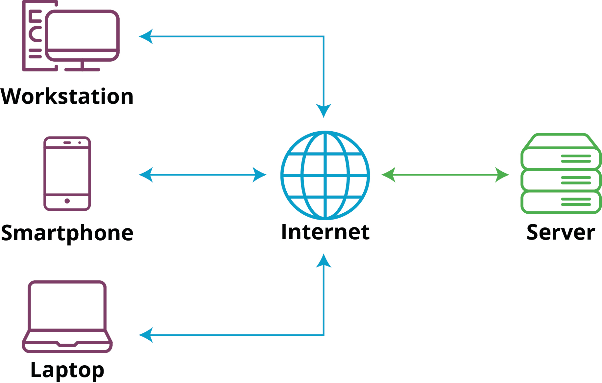
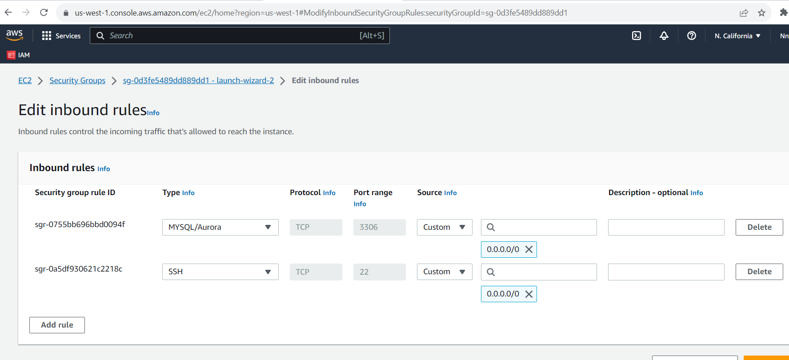

# client-server

## client-server architecture with mysql

We are talking about 2 different computers, but it depends on what role either of them is playing. Both can either be a program on a computer or the computer itself.

one of them sends a request which is the "__client__" while the other receives and processes the request which is the __"server"__.

Example: Just like when you browse in the internet. The browser itself is the __"client"__. The program or the software like __"Google chrome"__ is the __"client"__.

Then the __"server"__ will be the website that you are actually trying to access like (_facebook_).

For example: You go to your browser and type `www.ogechukwu.com`. it means that your browser is considered the __"client"__. it is sending request to the remote server and in turn would be expecting some kind of response from the remote server.

Your terminal will be the __"client"__ while `www.ogechukwu.com` will be the __"server"__.

__The client/server model__

* server -- the central database management program.

* client -- program connect to the server to retrieve or modify data.

__A diagram of web client-server architecture.__

__A diagram of web client-server with database.__

__Implement a client-server architecture using MySQL Database Management System. (DBMS)__ 

_Spin up two virtual server (Ec2 instances in AWS) and name them: __"mysql-server"__ and __"mysql-client"__._

Then We connect to the instances from two seperate ubuntu terminal.

After connecting to the instances on each of the terminals, we edit the /etc/hostname/ file to change the names of each of the server so as to align with the given name on the instance i.e __client__ and __server__ respectively. We do this using the command:

`$ sudo hostname server`

`$ sudo hostname client`

Then we refresh the terminal for the changes to reflect.

Results:

On the __server__ and __client__ terminals we run the command.

`$ sudo apt update`

Results:

We install mysql-server software on the __"server"__ terminal.

`$ sudo apt install mysql-server`

Results:

We install mysql-client software on the __"client"__ terminal.

Results:

We verify the status of mysql.

`$ sudo systemctl status mysql`

Results:

By default, both of your EC2 virtual servers are located in the same local virtual network, so they can communicate to each other using local IP addresses. Use mysql server's local IP address to connect from mysql client. MySQL server uses __TCP port 3306__ by default, so you will have to open it by creating a new entry in ‘Inbound rules’ in ‘mysql server’ Security Groups. For extra security, do not allow all IP addresses to reach your ‘mysql server’ – allow access only to the specific local IP address of your ‘mysql client’.

Results:

You might need to configure mysql server to allow connections from my remote hosts.

`$ sudo nano /etc/mysql/mysql.conf.d/mysqld.cnf`

Replace this __blind-address = 127.0.0.1__ to this __blind-address = 0.0.0.0__.

Results:

In your mysql-server ec2 instance allow the ip address of the mysql-client ec2 instance with port 3306 to access the mysql-server ec2 instance.

`curl http://checkip.amazonaws.com`

Results:

Note: '18.144.9.57' is the ip address of mysql-client.

set up mysql database in server that the client will be able to connect to:

`$ sudo mysql`

It will take us into the mysql database.

Results:

Next we run:

Then exit and start interactive script.

We put in the password we specified earlier (__Okekeoge@1__).To create a validated password, type __y__. Then choose the strength of the new password you want to create, we put in the new password.

Results:

log into mysql console

`$ sudo mysql -p`

Result:

Create a new database

`$ mysql> CREATE DATABASE `test_database`;`

then create a new user and grant him privilege on the database u just created.

`mysql> CREATE USER 'ogechukwu'@'%' IDENTIFIED WITH mysql_native_password BY 'Okekeoge@1';`

Give the user (__"ogechukwu"__) permission over the '_test_database_'  database.

`mysql> GRANT ALL ON test_database.* TO 'ogechukwu'@'%';`

Then we exit.

Let's test if the new user has the proper permission by logging into mysql console.

`mysql -u ogechukwu -p`

And put in the password you created

`Okekeoge@1`

We then go to our __client terminal__ and connect to the mysql server database remotely without using SSH.

`$ mysql -u ogechukwu -h <IP-address of the server> -p`

we put in our password and run this command:

`mysql> SHOW DATABASES;`

Result:

